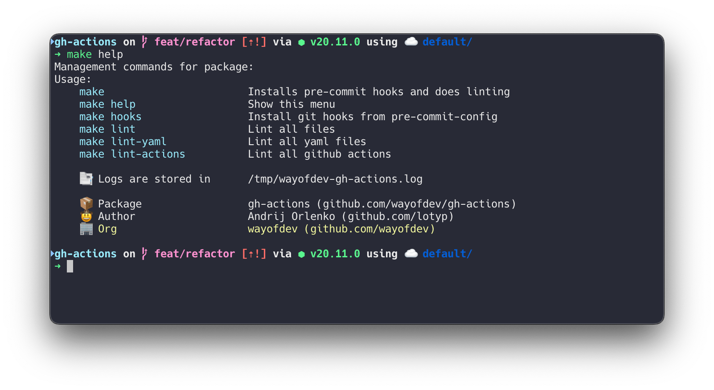

# Contributing

If you would like to contribute to this project, please open an issue or a pull request. We are always looking for ways to improve the project and would love to hear your ideas.

The latest changes are always in `master` branch, so please make your Pull Request against that branch.

<br>

## 🚩 Development Requirements

Before you begin, you will need to set up your local development environment. Here is what you'll need:

- **Operating System**: macOS Monterey+, Linux, or Windows with WSL2.
- **Docker**: Version 26.0.0 or newer. Installation guides:
    - [Docker on Ubuntu 22.04](https://www.digitalocean.com/community/tutorials/how-to-install-and-use-docker-on-ubuntu-22-04)
    - [Docker Desktop on Mac](https://docs.docker.com/desktop/install/mac-install/)
- **Homebrew** (macOS only): Install via [brew.sh](https://brew.sh/).

### → Optional Tools

- [Pre-commit](https://pre-commit.com) — Automates the running of git pre-commit hooks.
    - Installation: `brew install pre-commit` and `make hooks`
- [Cz-git](https://cz-git.qbb.sh) — Commitizen adapter, that assists in formatting git commits.
    - Installation: `brew install czg`
- [Act](https://github.com/nektos/act) — To run and test GitHub actions locally.
    - Installation: `brew install act`


<br>

## 🛠️ Makefile

This project uses a Makefile to streamline common development tasks. The Makefile includes utilities for managing Docker environments, running tests, and linting code.

Refer to the output of `make help` for a comprehensive list of available commands.

```bash
$ make help
```



## 💻 Workflow

> [!IMPORTANT]
>
> Please feature/fix/update... into individual PRs (not one changing everything)

- **Fork the Repository**: Start by forking the repository to your GitHub account.
- **Create a Branch**: In your fork, create a new branch for your work. Name it appropriately based on the feature, fix, or update you're working on.
- **Make Your Changes**: Implement your changes
- **Update Documentation**: If you've made changes that affect the project's documentation, ensure it is updated.
- **Run Linters**: Ensure your code passes all linting checks using `make lint`.
- **Commit Your Changes**: Use the [Conventional Commits](#-commit-message-guidelines) standard for your commit messages. You can use `make commit` to assist in creating commit messages.
- **Push Your Changes**: Push your branch to your fork on GitHub.
- **Open a Pull Request**: Submit a pull request to the `master` branch of the original repository. Ensure your PR is focused, addressing a single feature, fix, or improvement.

<br>

## ⚡️ Continuous Integration with GitHub Actions

Our project employs [GitHub Actions](https://github.com/features/actions) for continuous integration, ensuring code quality and reliability. We encourage contributors to review our workflow configurations to understand the CI processes:

- [`workflows/integrate.yml`](workflows/integrate.yml)
- [`workflows/triage.yml`](workflows/triage.yml)
- [`workflows/release.yml`](workflows/create-arch-diagram.yml)

<br>

## ✉️ Commit Message Guidelines

We follow the [Conventional Commits](https://www.conventionalcommits.org/en/v1.0.0/) standard. Please structure your commit messages as follows, using the appropriate prefix:

**Examples:**

```bash
$ git commit -am 'feat: some feature was introduced'
$ git commit -am 'fix: something has been fixed'
```

**Allowed Prefixes:**

| Prefix     | Purpose                                                       |
|------------|---------------------------------------------------------------|
| `feat`     | Introduces a new feature                                      |
| `fix`      | Fixes a bug                                                   |
| `perf`     | Improves performance                                          |
| `docs`     | Documentation only changes                                    |
| `style`    | Code style changes (formatting, missing semi-colons, etc.)    |
| `deps`     | Updates dependencies                                          |
| `refactor` | Code changes that neither fixes a bug nor adds a feature      |
| `ci`       | Changes to our CI configuration files and scripts             |
| `test`     | Adding missing tests or correcting existing tests             |
| `revert`   | Reverts a previous commit                                     |
| `build`    | Changes that affect the build system or external dependencies |
| `chore`    | Other changes that don't modify src or test files             |
| `security` | A code change that fixes a security issue                     |

<br>

## 🔍 Coding Standards and Tools

We enforce coding standards to maintain high code quality and readability. Here's a list of tools we use:

### → Yaml Lint

We use [`yamllint`](https://github.com/adrienverge/yamllint) to enforce coding standards in YAML files.

To lint yaml files run:

```bash
$ make lint-yaml
```

by default, [`cytopia/yamllint`](https://github.com/cytopia/docker-yamllint) Docker image will be used to run linter.

### → Action Lint

We use [`actionlint`](https://github.com/rhysd/actionlint) to enforce coding standards in GitHub Actions workflows.

To lint GitHub Actions run:

```bash
$ make lint-actions
```

by default, [`rhysd/actionlint`](https://hub.docker.com/r/rhysd/actionlint/tags) Docker image will be used to run linter.

<br>

## 📦 Pre-commit Hooks

Pre-commit hooks are an optional but highly recommended way to automate the linting and quality checks before committing changes to the repository. This project provides a predefined configuration that helps in maintaining code quality and consistency.

### → Configured Hooks

Our pre-commit configuration includes several hooks:

- **Trailing Whitespace**: Removes unnecessary trailing spaces.
- **End-of-File Fixer**: Ensures that files end with a newline.
- **Check Added Large Files**: Prevents accidentally adding large files to the git repository, with a current limit set to 600 KB.
- **Commitizen**: Ensures commit messages meet the conventional commit format. This hook is triggered at the commit message stage.

### → Installing Pre-commit Hooks

To utilize these hooks, you first need to install them using the command provided by the Makefile:

```bash
$ make hooks
```

<br>
